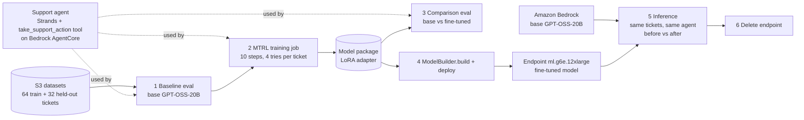
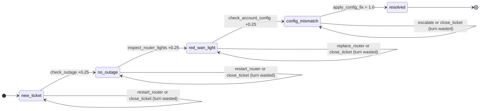
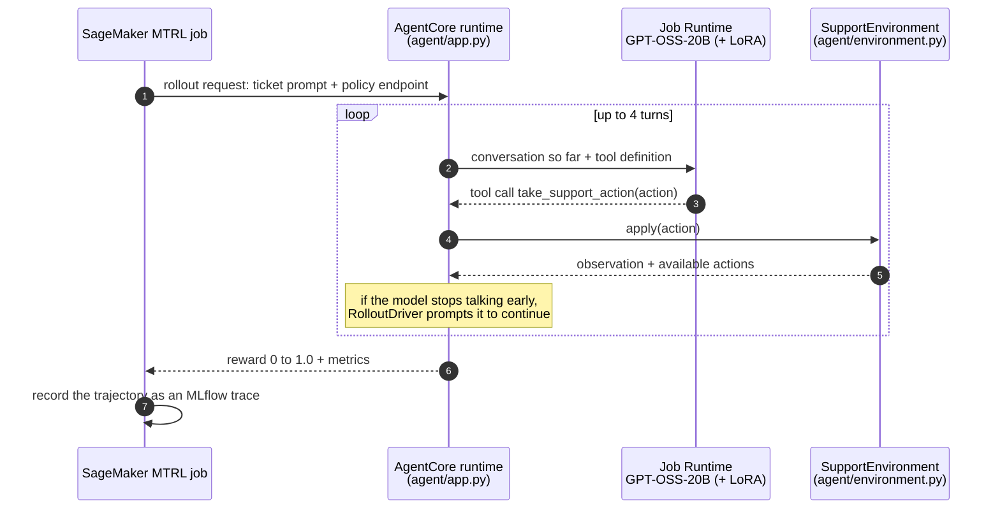
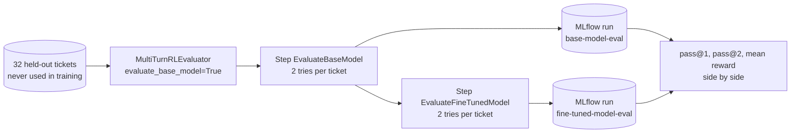
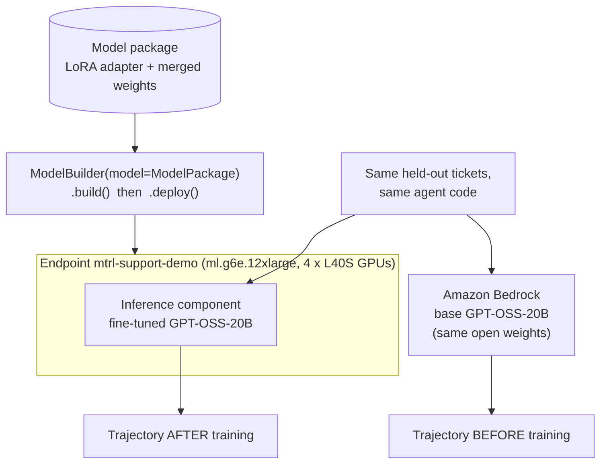
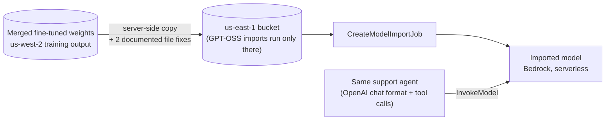

# How the SageMaker Multi-Turn RL demo works

This page draws every moving part of the demo: the task, a single rollout, a
training step, the evaluation, and the deployment used for before/after
inference. Everything runs on real AWS resources in `us-west-2` and follows the
official guide:
[Multi-turn reinforcement learning in SageMaker AI](https://docs.aws.amazon.com/sagemaker/latest/dg/model-customize-mtrl.html).

The notebook [`notebooks/sagemaker_mtrl_real_demo.ipynb`](notebooks/sagemaker_mtrl_real_demo.ipynb)
walks through the same steps with live outputs.

---

## 1. The whole pipeline in one picture

```text
  S3: 64 training tickets            Support agent (Strands + 1 tool)
      32 held-out tickets            hosted on Bedrock AgentCore
            │                                   │
            ▼                                   ▼
  ┌──────────────────┐   ┌──────────────────────────────────┐   ┌───────────────────┐
  │ 1. BASELINE EVAL │──▶│ 2. MTRL TRAINING JOB             │──▶│ Model package     │
  │ base GPT-OSS-20B │   │ 10 steps × 32 tickets × 4 tries  │   │ = LoRA adapter    │
  └──────────────────┘   └──────────────────────────────────┘   └─────────┬─────────┘
                                                                        │
             ┌──────────────────────────────────────────────────────────┤
             ▼                                                          ▼
  ┌──────────────────────────────┐            ┌────────────────────────────────────────┐
  │ 3. COMPARISON EVAL           │            │ 4. DEPLOY (ModelBuilder)               │
  │ base vs fine-tuned,          │            │ endpoint on ml.g6e.12xlarge serving    │
  │ same 32 held-out tickets     │            │ the fine-tuned model (LoRA merged in)  │
  └──────────────────────────────┘            └──────────────────┬─────────────────────┘
                                                                 ▼
                                              ┌────────────────────────────────────────┐
                                              │ 5. INFERENCE: same tickets, same agent │
                                              │  before: base GPT-OSS-20B (Bedrock)    │
                                              │  after:  fine-tuned model (endpoint)   │
                                              └──────────────────┬─────────────────────┘
                                                                 ▼
                                                     6. DELETE THE ENDPOINT
```



---

## 2. The task: a 4-turn troubleshooting game

A customer says the internet is down. The agent gets **4 turns**. Each turn it
calls one tool, `take_support_action(action)`, with one of three options. Only
one option per situation moves the diagnosis forward.



| Correct steps | Reward | Meaning |
|---|---|---|
| 0 | 0.00 | Nothing diagnosed |
| 1 | 0.25 | Outage ruled out |
| 2 | 0.50 | Router light checked |
| 3 | 0.75 | Config problem found, but out of turns |
| 4 | **1.00** | Connection restored (counts as "solved" for pass@k) |

The base model's typical mistake is the shortcut **`restart_router`**. It wastes
one of the four turns, so the episode ends at 0.75 instead of 1.0. That is the
habit training should remove.

---

## 3. One rollout: what happens inside SageMaker

The same rollout runs during baseline evaluation, training, and comparison
evaluation. Only the policy model changes (base, or base + the current LoRA).



---

## 4. One training step: how the model learns

```text
 32 tickets per step ──▶ 4 rollouts each (128 conversations) ──▶ 128 rewards
                                                          │
       ticket "My internet is not working"                ▼
       rollout 1: check_outage → … → fixed        reward 1.00   above group average ▲
       rollout 2: restart_router → … (1 short)    reward 0.75   below group average ▼
       rollout 3: check_outage → … → fixed        reward 1.00   above group average ▲
       rollout 4: check_outage → restart_router…  reward 0.75   below group average ▼
                                                          │
                                                          ▼
          PPO update of the LoRA weights (rank 32) on GPT-OSS-20B:
          actions from above-average rollouts become more likely,
          actions from below-average rollouts become less likely
                                                          │
                                                          ▼
                       new policy ──▶ next step (10 steps in total)
```

Only groups with different rewards teach anything. If all 4 tries of a ticket
score the same, that ticket contributes no learning signal in that step. That
is why the demo checks the baseline for reward variance before training.

---

## 5. Evaluation: base vs fine-tuned



Every one of these conversations is stored as an MLflow trace: the ticket, the
model's reasoning, each tool call, and the reward. The notebook reads them back
and shows the base and the fine-tuned model side by side on the same tickets.
This is the strongest before/after evidence, because both models ran in the
same pipeline on the same serving stack.

- **pass@1**: share of tickets fully solved on a single try.
- **pass@2**: share of tickets solved in at least one of two tries.
- **mean reward**: average score, including partial credit.

---

## 6. Deployment and before/after inference

The training job's output is a model package containing the trained **LoRA
adapter** (a small set of extra weights) and the same adapter **merged** into
GPT-OSS-20B. Following the guide, `ModelBuilder(model=ModelPackage).build()`
then `.deploy()` serves the merged fine-tuned model from one inference
component on a real-time endpoint.



The notebook runs the same agent loop (same prompt, same tool, same
environment, same action order) with both models, prints both conversations
turn by turn, and then **deletes the endpoint**. GPU instances are not always
available: if SageMaker cannot provision `ml.g6e.12xlarge`, the endpoint fails
before any instance runs, nothing is billed, and the notebook says so. The rigorous comparison is
the evaluation in section 5, where both models ran in the same SageMaker
pipeline.

### Option 2 from the guide: Amazon Bedrock Custom Model Import

When no GPU capacity is free for the endpoint, the guide's second option
serves the **same fine-tuned weights** serverlessly. There is no instance to
provision; it is billed per active minute and scales to zero when idle.



The two fixes: the chat template is embedded in `tokenizer_config.json`, and
`generation_config.json` gets all three GPT-OSS end-of-sequence token IDs.

---

## 7. Where each piece lives

| Piece | File |
|---|---|
| Task, states, rewards | [`agent/environment.py`](agent/environment.py) |
| Agent served by AgentCore (rollouts) | [`agent/app.py`](agent/app.py) |
| Keeps the conversation going turn by turn | [`agent/rollout_driver.py`](agent/rollout_driver.py) |
| One facade that wires every stage | [`aws/workflow.py`](aws/workflow.py) |
| Settings, project paths, resource state | [`aws/config.py`](aws/config.py) |
| Account setup and teardown | [`aws/setup/`](aws/setup/) |
| Training (run or re-attach) | [`aws/rl/training.py`](aws/rl/training.py) |
| Base vs fine-tuned evaluation | [`aws/rl/evaluation.py`](aws/rl/evaluation.py), [`aws/rl/pipelines.py`](aws/rl/pipelines.py) |
| Recorded before/after conversations | [`aws/rl/trajectories.py`](aws/rl/trajectories.py) |
| Endpoint deployment, deletion, and watchdog | [`aws/deploy/deployment.py`](aws/deploy/deployment.py), [`aws/deploy/endpoint_watchdog.py`](aws/deploy/endpoint_watchdog.py) |
| Bedrock import (deploy option 2) | [`aws/deploy/bedrock_import.py`](aws/deploy/bedrock_import.py) |
| Before/after inference | [`aws/deploy/inference.py`](aws/deploy/inference.py) |
| Budget guard (hard $25 cap) and costs | [`aws/costs/`](aws/costs/) |
| Redacted evidence files | [`aws/records/evidence.py`](aws/records/evidence.py), [`artifacts/`](artifacts/) |
| What actually ran (provenance) | [`aws/records/provenance.py`](aws/records/provenance.py), `artifacts/*_provenance.json` |
| Report tables, figures, repro record, invariants | [`aws/reporting/`](aws/reporting/), [`reports/`](reports/) |
| Numbered pipeline (what you run) | [`scripts/`](scripts/) `00` to `14`, `99` (see [README.md](README.md)) |
| Notebook | [`notebooks/sagemaker_mtrl_real_demo.ipynb`](notebooks/sagemaker_mtrl_real_demo.ipynb), built by [`scripts/dev/build_notebook.py`](scripts/dev/build_notebook.py) |

---

## 8. Cost and safety guardrails

- **Hard $25 cap.** Before training, the comparison, the endpoint, the Bedrock
  import, and live inference, a budget guard adds up the spend so far and the
  planned steps, and refuses any plan above $25. The spend so far is billed
  tokens plus recorded amounts.
- **Explicit confirmations.** Each billable step needs its own exact phrase.
  Replacing a failed job, or rebuilding the agent that recorded jobs used,
  needs a separate phrase.
- **No double billing.** Every job is recorded; re-running the notebook or a
  script re-attaches to it instead of submitting a new one. A later live
  inference run never overwrites the recorded one.
- **Endpoint time limit.** The endpoint (about $13 per hour) is deleted at the
  end of the run, with a watchdog that deletes it after 60 minutes at the latest.
- **No leaked links.** Temporary MLflow sign-in links printed by the SDK are
  removed from saved notebooks, evidence files, and logs.
- **Checkable afterwards.** `scripts/11b_snapshot_provenance.py` records what
  actually ran:
  - the agent's source and container image
  - the S3 datasets
  - the imported weights

  `scripts/14_verify_invariants.py` re-checks all of it offline, along with the
  results and the costs.
